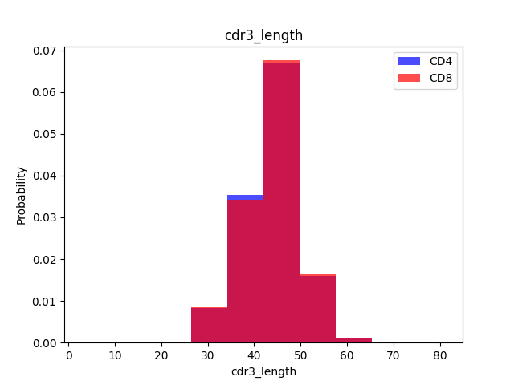
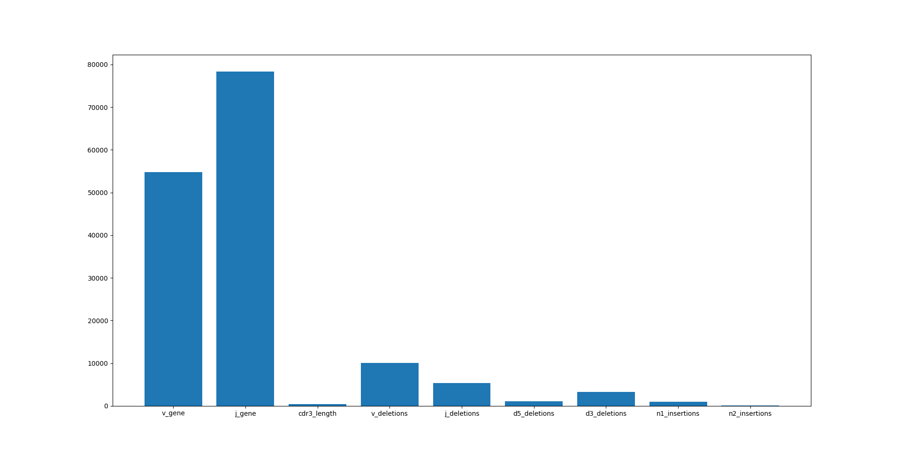
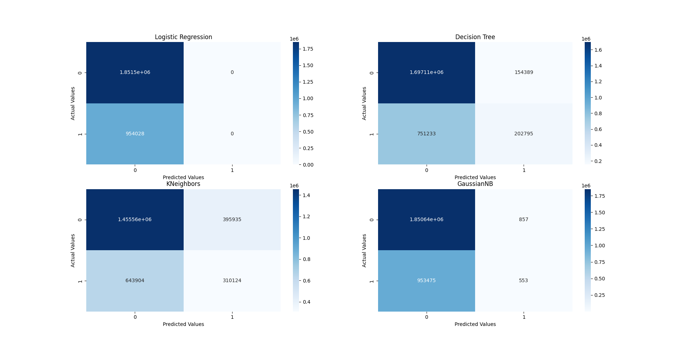
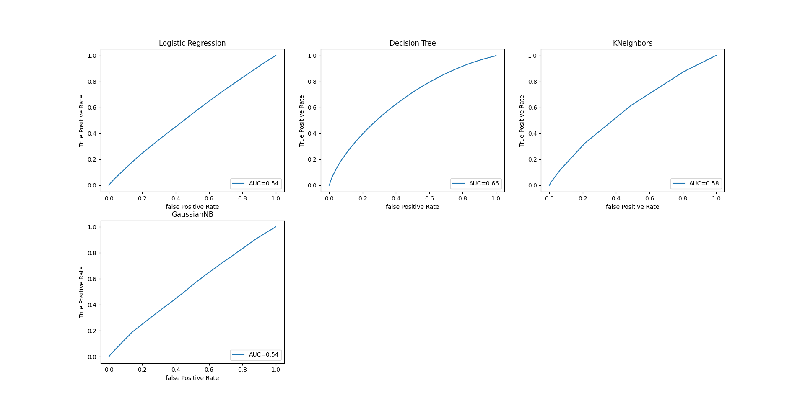

# Predictive-Analysis-of-CD4/8 ratio
- Build ML classification model with selected parameters training TERI baseline\
- Classification model identifies **which Cells (CD4 or CD8) a sequences belongs to**

## Load Trained Dataset and Data Overview
- A **training base table** is typically stored in a pandas dataframe. Several important variables in the basetable are : **`v_gene`**, **`j_gene`**, **`cdr3_length`**, **`v_deletions`**, **`j_deletions`**, etc. and the target CD4 or CD8 column **`CD4/8`**
- **CD4/8** is the event to **`predict`**

```python
import pandas as pd
df_cd4 = pd.read_csv('./cd4_basetable.csv', sep='\t')
df_cd4['CD4/8'] = 'CD4'

df_cd8 = pd.read_csv('./cd8_basetable.csv', sep='\t')
df_cd8['CD4/8'] = 'CD8'
df = pd.concat([df_cd4, df_cd8], ignore_index=True, sort=False)

df1 = df[['v_gene', 'j_gene', 'cdr3_length', 'v_deletions', 'j_deletions', 'd5_deletions', 'd3_deletions', 'n1_insertions', 'n2_insertions', 'CD4/8']].reset_index(drop=True)
df1.to_csv('./testtable.csv', sep=',', index=False)
```

## Exploratory Data Analysis (EDA)
- robust analysis of each parameter

```python
for label in base_df.groupby('subject_id').columns:
    plt.hist(df[df['CD4/8'] == '1'][label], color='blue', label='CD4', alpha=0.7, density=True)
    plt.hist(df[df['CD4/8'] == '0'][label], color='red', label='CD8', alpha=0.7, density=True)
    plt.title(label)
    plt.ylabel('Probability')
    plt.xlabel(label)
    plt.legend()
```

<p align="center">
  
</p>

## Split Dataset into Training and Testing Set
- firstly need to encode the categorical parameters (v_gene and j_gene)

```python
# adapted from https://towardsdatascience.com/top-machine-learning-algorithms-for-classification-2197870ff501
def load_dataset(filename):
    data = read_csv(filename, sep=',')

    x_1 = data.iloc[:, 0:9]
    print(x_1)
    enc = OrdinalEncoder()
    enc.fit(x_1[['v_gene', 'j_gene']])
    x_1[['v_gene', 'j_gene']] = enc.transform(x_1[['v_gene', 'j_gene']])
    X = x_1.values
    print(x_1)
    print(X)

    Y_1 = data.iloc[:, -1]
    le = LabelEncoder()
    le.fit(Y_1)
    y = le.transform(Y_1)
    print(Y_1)
    print(y)

    features = data.columns[0:9].values
    print(features)
    return X, y, features
    
# split into train and test.txt sets
X_train, X_test, y_train, y_test = train_test_split(X, y, test_size=0.2, random_state=1)
```

## Features Selection
- set k-mer as 4
- select the most fitted four features among these 9 parameters
- use the most fitted features for following prediction

```python
def select_features(X_train, y_train, X_test):
    fs = SelectKBest(score_func=chi2, k=4)  # two possibilities: chi2, mutual_info_classif
    fs.fit(X_train, y_train)
    X_train_fs = fs.transform(X_train)
    X_test_fs = fs.transform(X_test)
    return X_train_fs, X_test_fs, fs

# feature selection
X_train_fs, X_test_fs, fs = select_features(X_train_enc, y_train_enc, X_test_enc)

# what are scores for the features
for i, j in zip(features, range(len(fs.scores_))):
    print(f'Feature {i}:  {fs.scores_[j]}')
# # plot the scores
plt.bar([i for i in features], fs.scores_)
plt.show()
```

<p align="center">
  
</p>

- As shown in the above figure, the four most fitted parameters are **`v_gene`**, **`j_gene`**, **`v_deletions`**, **`j_deletions`**.

## Build Classification Model Pipeline

```python
# machine learning model pipeline
model_pipeline = []
model_pipeline.append(LogisticRegression(solver='liblinear'))
# model_pipeline.append(SVC())
model_pipeline.append(DecisionTreeClassifier())
# model_pipeline.append(RandomForestClassifier())
model_pipeline.append(KNeighborsClassifier())
model_pipeline.append(GaussianNB())
model_list = ['Logistic Regression', 'Decision Tree', 'KNeighbors', 'GaussianNB']  # 'Random Forest',
```

## Model Evaluation and Selection of the most precise model
- Accuracy
- ROC Curve and AUC
- Confusion Matrix

```python
acc_list = []
auc_list = []
cm_list = []
fpr_list = []
tpr_list = []

for model in model_pipeline:
    model.fit(X_train_fs, y_train)
    y_pred = model.predict(X_test_fs)
    acc_list.append(accuracy_score(y_test, y_pred))
    false_positive_rate, true_positive_rate, _ = roc_curve(y_test, y_pred)
    fpr_list.append(false_positive_rate)
    tpr_list.append(true_positive_rate)
    auc_list.append(round(auc(false_positive_rate, true_positive_rate), 2))
    cm_list.append(confusion_matrix(y_test, y_pred))
 ```
 
## Plot the Evaluation Result

### Confusion Matrix
```python
# plot confusion matrix
fig = plt.figure(figsize=(18, 10))
for n in range(len(cm_list)):
    con_matrix = cm_list[n]
    model = model_list[n]
    sub = fig.add_subplot(2, 2, n + 1).set_title(model)
    cm_plot = sns.heatmap(con_matrix, annot=True, cmap='Blues', fmt='g')
    cm_plot.set_xlabel('Predicted Values')
    cm_plot.set_ylabel('Actual Values')
plt.show()
```

<p align="center">
  
</p>

### ROC Curves
```python
# plot ROC curves
fig = plt.figure(figsize=(18, 10))
for n in range(len(acc_list)):
    auc_value = auc_list[n]
    fpr = fpr_list[n]
    tpr = tpr_list[n]
    model = model_list[n]
    sub = fig.add_subplot(2, 2, n + 1).set_title(model)
    plt.plot(fpr, tpr, label="AUC=" + str(auc_value))
    plt.xlabel('false Positive Rate')
    plt.ylabel('True Positive Rate')
    plt.legend(loc=4)
plt.show()
```

<p align="center">
  
</p>

### Accuray and AUC values

```python
# Accuracy and AUC
result_df = pd.DataFrame({'Model': model_list, 'Accuracy': acc_list, 'AUC': auc_list})
print(result_df)
```
#### The Evaluation Results Table

|  Model  |Accuracy| AUC Score|
:--------:|:------:|:--------:|
| Logistic Regression |0.659947   |0.54    |
| Decision Tree |0.677201   |0.66    |
| KNeighbors |0.629360   |0.58    |
| GaussianNB |0.659838   |0.54    |
