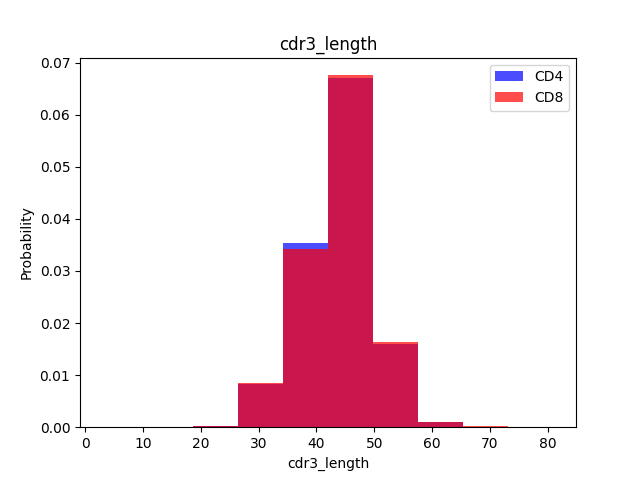

# Predictive-Analysis-of-CD4/8 ratio
Build ML classification model with selected parameters training TERI baseline\
Classification model identifies **which Cells a sequences belongs to**

## Build Classification Model Pipeline
### Load Trained Dataset and Data Overview
- A **training base table** is typically stored in a pandas dataframe. Several important variables in the basetable are : **`v_gene`**, **`j_gene`**, **`cdr3_length`**, **`v_deletions`**, **`j_deletions`** and the target CD4 or CD8 column **`CD4/8`**
- **CD4/8** is the event to **`predict`**

```python
import pandas as pd
df_cd4 = pd.read_csv('./cd4_basetable.csv', sep='\t')
df_cd4['CD4/8'] = 'CD4'

df_cd8 = pd.read_csv('./cd8_basetable.csv', sep='\t')
df_cd8['CD4/8'] = 'CD8'
df = pd.concat([df_cd4, df_cd8], ignore_index=True, sort=False)

df1 = df[['v_gene', 'j_gene', 'cdr3_length', 'v_deletions', 'j_deletions', 'CD4/8']].reset_index(drop=True)
df1.to_csv('./testtable.csv', sep=',', index=False)
```

### Exploratory Data Analysis (EDA)
```python
for label in base_df.groupby('subject_id').columns:
    plt.hist(df[df['CD4/8'] == '1'][label], color='blue', label='CD4', alpha=0.7, density=True)
    plt.hist(df[df['CD4/8'] == '0'][label], color='red', label='CD8', alpha=0.7, density=True)
    plt.title(label)
    plt.ylabel('Probability')
    plt.xlabel(label)
    plt.legend()
```

<p align="center">
  
</p>

### Split Dataset into Training and Testing Set
```python
# adapted from https://towardsdatascience.com/top-machine-learning-algorithms-for-classification-2197870ff501
def load_dataset(filename):
    data = read_csv(filename, sep=',')

    x_1 = data.iloc[:, 0:9]
    print(x_1)
    enc = OrdinalEncoder()
    enc.fit(x_1[['v_gene', 'j_gene']])
    x_1[['v_gene', 'j_gene']] = enc.transform(x_1[['v_gene', 'j_gene']])
    X = x_1.values
    print(x_1)
    print(X)

    Y_1 = data.iloc[:, -1]
    le = LabelEncoder()
    le.fit(Y_1)
    y = le.transform(Y_1)
    print(Y_1)
    print(y)

    features = data.columns[0:9].values
    print(features)
    return X, y, features
    
# split into train and test.txt sets
X_train, X_test, y_train, y_test = train_test_split(X, y, test_size=0.2, random_state=1)
```

### Features selection
- select the most fitted features among these 5 parameters

```python
fs = SelectKBest(score_func=chi2, k=4)  # two possibilities: chi2, mutual_info_classif
fs.fit(X_train, y_train)
X_train_fs = fs.transform(X_train)
X_test_fs = fs.transform(X_test)
return X_train_fs, X_test_fs, fs
```
